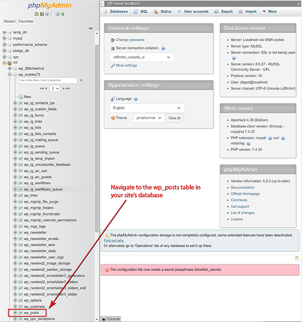
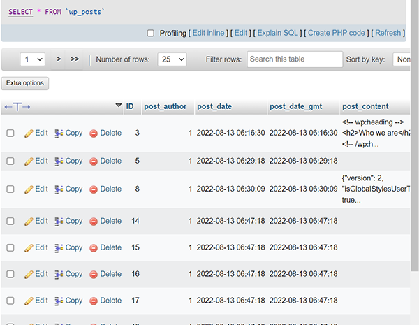
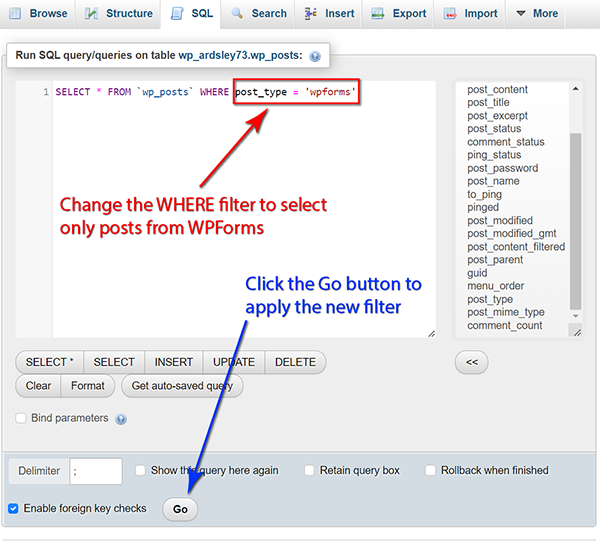
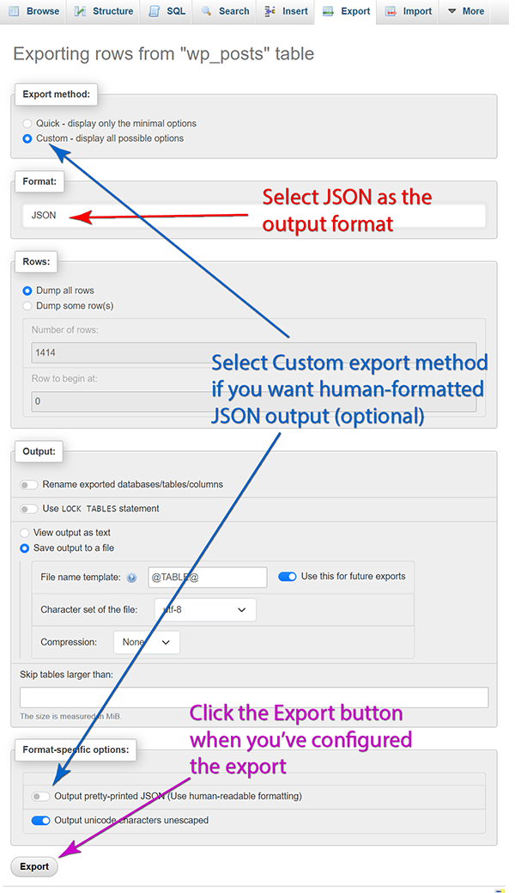
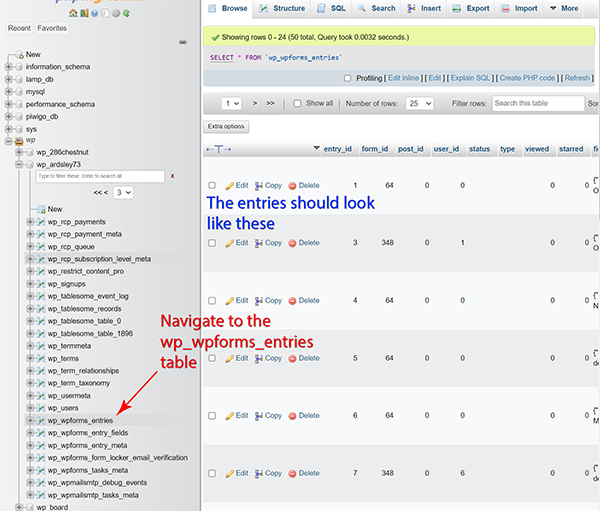
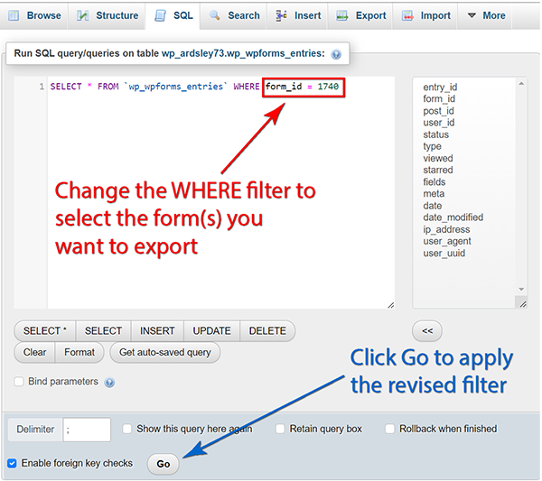

# J4JSoftware.WpFormsSurveyProcessor

- [J4JSoftware.WpFormsSurveyProcessor](#j4jsoftwarewpformssurveyprocessor)
  - [Overview](#overview)
  - [Command Line Options](#command-line-options)
  - [Export File Name](#export-file-name)
  - [Defining Named Ranges](#defining-named-ranges)
  - [Creating the Required Files](#creating-the-required-files)
    - [Creating the Forms Definition File](#creating-the-forms-definition-file)
    - [Creating the User Entries File](#creating-the-user-entries-file)

## Overview

**WpFormsSurveyProcessor** exports WordPress WPForms form and survey response data to an Excel (xlsx) file. You can export one or more of the following data sets, each of which will be on a separate worksheet (the bolded terms refer to the command line values used to restrict output to certain datasets):

- WpForms id and name (**FormInformation**)
- Field descriptions, including form and field ids (**FieldDescriptions**)
- Details on choices for choice fields (e.g., checkbox, radio) (**FieldDescriptions**)
- User responses/submissions (**Submissions**)

You can also export all the datasets using the command line term **All** (which is the default and need not be specified).

## Command Line Options

The option flags are case insensitive.

|Option|Description|
|:----:|-----------|
|/h, /help|Display simple help information|
|/d, /docs|Display this documentation in a browser|
|/c, /config|Path to the application configuration file. If not specified, the default *appConfig.json* file in the application directory is used|
|/p, /posts|Path to the file containing the WordPress posts. This is where WpForms stores form definitions. See below for details on creating this file.|
|/e, /entries|Path to the file containing the WpForms user entries. See below for details on creating this file.|
|/x, /excel|Path to the export file created by the program. *Warning: existing files will be overwritten without confirmation.*|
|/s, /scope|Defines the information/worksheets to be exported. See below for details.|
|/t, /ts|Defines the time stamp, if any, added to the Excel file name. See below for details.|
|/f, /formIds/|A list of form ids to export. If not specified, all forms will be exported.|
|/i, /formInfo|Displays a list of form names and ids contained in the provided WordPress posts file.|

The /f and /s options allow multiple values to be provided, separated by either commas or spaces.

## Export File Name

When you specify an export file name it is checked to ensure it can be written. If for some reason the path you supply is not, the export file name will be changed to something that is writable. This could result in the export file being written to the current directory, so if you don't find the file where you expect it, review the actual name of the file being written. That's echoed to the console when it is created.

You can modify how export files are time stamped through the command line or by modifying the `appJson.config` file, located in the executable folder. The available options are:

|Time Stamp Option|Description|
|:---------------:|-----------|
|None|No time stamp is added|
|DateOnly|A yyyy-mm-dd (year/month/day) time stamp is added|
|DateAndTime|A yyyy-mm-dd hh-mm-ss (year/month/day hours/minutes/seconds) time stamp is added|

## Defining Named Ranges

The default *appConfig.json* configuration file defines a number of named ranges that are created when data is exported. You can define your own by modifying the file, which is located in the directory/folder where you installed the application.

Here are the default settings:

```json
{
  "ExcelFileInfo" : {
    "RangeConfigurations": {
      "Forms": [
        {
          "Name": "FormIds",
          "Context": "Worksheet",
          "FirstColumn": "A"
        },
        {
          "Name": "FormNames",
          "Context": "Worksheet",
          "FirstColumn": "A",
          "LastColumn": "B"
        }
      ],
      "Fields": [
        {
          "Name": "Fields",
          "Context": "Worksheet",
          "FirstColumn": "C",
          "LastColumn": "E"
        }
      ],
      "Choices": [
        {
          "Name": "Choices",
          "Context": "Worksheet",
          "FirstColumn": "E",
          "LastColumn": "F"
        }
      ],
      "Submissions": [
        {
          "Name": "FieldKeys",
          "Context": "Worksheet",
          "FirstColumn": "H"
        },
        {
          "Name": "SubfieldKeys",
          "Context": "Worksheet",
          "FirstColumn": "I"
        },
        {
          "Name": "ResponseIndices",
          "Context": "Worksheet",
          "FirstColumn": "J"
        },
        {
          "Name": "Responses",
          "Context": "Worksheet",
          "FirstColumn": "K"
        }
      ]
    }
  }
}
```

Each exported spreadsheet is targeted by a property identified by its name, and includes one array of objects defining the named ranges to be created. The full syntax for the named range object looks like this:

```json
{
    "Name": range's name,
    "Context": the value Worksheet or Workbook (see below),
    "FirstColumn": the letter of the column starting the range,
    "LastColumn": the letter ending the range (see below),
    "IncludeHeader": true or false (see below)
}
```

For **Context**, Worksheet means the range is defined at the worksheet level and you'll need to refer to it as *sheetname!range-name*. Workbook means the range is defined at the workbook level, and doesn't require a prefix to be referenced.

**LastColumn** is optional. If omitted, the named range will be one column wide (i.e., the last column will be the same as the first).

**IncludeHeader** controls whether or not the header row is included in the named range. By default it's false and the header is *not* included.

## Creating the Required Files

**WpFormsSurveyProcessor** requires at least a definition of the WpForms objects to display information about the forms. To export data, however, it also requires the user submissions. Both of these files can be exported from the database used by you WordPress website.

There are various ways to do this, depending on how comfortable you are with directly accessing that database. However, the simpler approach is to use **PhpMyAdmin**, if it's available for your site. These directions use that approach.

### Creating the Forms Definition File

Navigate to the *wp_posts* table, which WordPress uses to contain all of the posts in your site, which includes the definitions of your WPForms forms.



The wp_posts table contains entries like the following:



You could simply export this entire file and process it. But it's likely to be quite large, so a better way is to extract only the posts created by WPForms. You can do that by clicking on the **SQL** tab at the top of the right-hand pane and modifying the default filter condition. After making the change, click the Go button:



Now click the **Export** tab at the top of the right-hand pane, select JSON as the output format, and click the Go button.



You can also format the JSON in human-friendly form if you want to, although that's not required.

The export generates a file you download and save someplace where **WpFormsSurveyProcessor** can access it.

### Creating the User Entries File

Navigate to the *wp_wpforms_entries* table, which WPForms uses to contain survey responses. It will look something like this:



As with the wp_forms table, you can export this entire table and process it. But if you only want the information for one or a few surveys it's worth filtering the table before exporting it. You do this by changing the WHERE condition on the SQL tab in the right-hand pane:



The rest of the export process mimics what was described for creating the forms definition file: select JSON as the export format, click Export, and save the downloaded file someplace where **WpFormsSurveyProcess** can access it.
